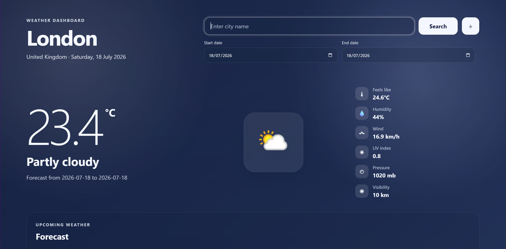
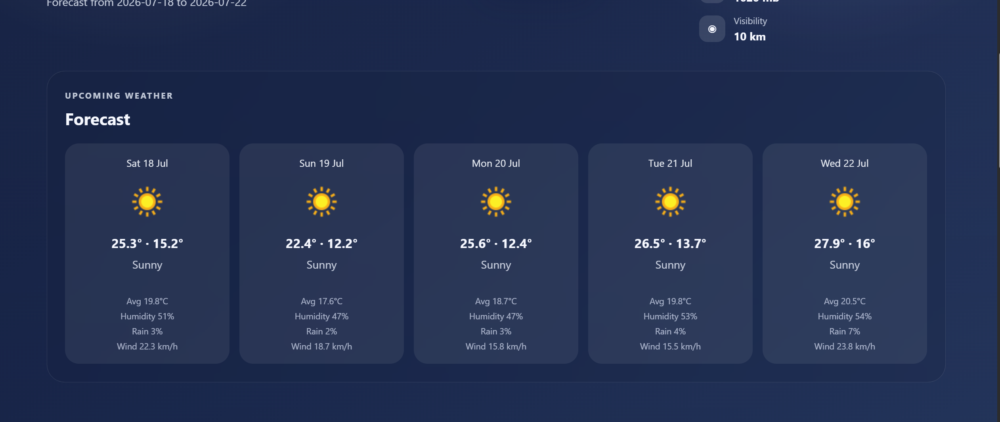
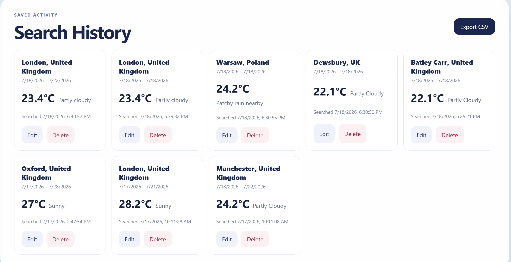

# 🌤️ Weather Dashboard

A modern Full Stack Weather Dashboard built with **React, TypeScript, Express, Prisma, and PostgreSQL**. The application allows users to search weather information for any location, view current weather and forecasts, manage previous searches with full CRUD operations, export weather history, and explore travel videos related to the searched location.

**Developed by:** Aeiman Imtiaz

---

# Features

## Weather Search

- Search weather by:
  - City
  - Town
  - Landmark
  - GPS Coordinates
- Get current weather conditions
- View weather icons
- View detailed weather metrics including:
  - Temperature
  - Feels Like
  - Humidity
  - Wind Speed
  - UV Index
  - Pressure
  - Visibility
- View forecast for the selected date range (up to 14 days)

---

## Current Location

- Detect user's current location using browser Geolocation API
- Automatically retrieve weather for the current location

---

## Search History

All searches are stored in PostgreSQL.

Users can:

- View previous searches
- Edit previous searches
- Delete searches

---

## Weather Data Export

Export all stored weather history as:

- CSV

---

## Travel Inspiration

Integrated with the **YouTube Data API**.

For every searched location, the application displays travel videos such as:

- Things to do
- Travel guides
- Places to visit

---

## Responsive Design

The application adapts to:

- Desktop
- Laptop
- Tablet
- Mobile

---

# Technology Stack

## Frontend

- React
- TypeScript
- Vite
- CSS

## Backend

- Node.js
- Express.js
- TypeScript

## Database

- PostgreSQL
- Prisma ORM

## External APIs

- WeatherAPI
- YouTube Data API v3

---

# Project Structure

```
weather-dashboard/
│
├── frontend/
│   ├── src/
│   ├── public/
│   └── ...
│
├── backend/
│   ├── src/
│   ├── prisma/
│   └── ...
│
└── README.md
```

---

# Backend Features

RESTful API built with Express.

### Weather

| Method | Endpoint | Description |
|---------|----------|-------------|
| POST | `/api/weather/search` | Create weather search |
| GET | `/api/weather/history` | Retrieve search history |
| GET | `/api/weather/:id` | Retrieve one weather search |
| PATCH | `/api/weather/:id` | Update weather search |
| DELETE | `/api/weather/:id` | Delete weather search |
| GET | `/api/weather/export/csv` | Export weather history |

### Travel Videos

| Method | Endpoint |
|---------|----------|
| GET | `/api/videos?location=London` |

---

# Database Schema

The application uses **PostgreSQL** with **Prisma ORM** to store weather searches and forecast data.

The database consists of three related models:

```text
Location
   │
   └───< WeatherRequest
              │
              └───< Forecast
```

## Location

The `Location` model stores reusable geographic information such as the city, country, latitude, and longitude. A unique constraint on **city + country** prevents duplicate location records.

## WeatherRequest

The `WeatherRequest` model represents a single weather search. It stores:

- Selected location
- Search timestamp
- Requested date range
- Current weather snapshot (temperature, humidity, wind speed, condition)
- Additional weather details (feels like, UV index, pressure, visibility)
- Optional JSON data returned by the weather API

Each weather request belongs to one location and can contain multiple forecast records.

## Forecast

The `Forecast` model stores daily forecast information for each weather request, including:

- Date
- Minimum, maximum, and average temperature
- Humidity
- Wind speed
- Chance of rain
- Weather condition and icon

Each weather request can have multiple forecast entries (one for each day in the selected date range).

## Relationships

- **One Location → Many Weather Requests**
- **One Weather Request → Many Forecasts**

This normalized design avoids duplicate location records while efficiently storing search history and forecast data.

The `Forecast` model uses **cascade delete**, ensuring that when a weather request is deleted, all associated forecast records are automatically removed, preventing orphaned data.

---

# Validation

The backend validates:

- Valid locations
- Valid date ranges
- Maximum forecast range
- Missing fields
- Invalid Weather API responses

---

# Error Handling

Gracefully handles:

- Invalid city names
- Network failures
- Weather API failures
- YouTube API failures
- Invalid date ranges

---

# Installation

## Clone repository

```bash
git clone https://github.com/Aeiman191/Weather-App.git
```

---

## Backend

```bash
cd backend

npm install

npx prisma generate

npx prisma migrate dev

npm run dev
```

---

## Frontend

```bash
cd frontend

npm install

npm run dev
```

---

# Environment Variables

## Backend

Create `.env`

```env
DATABASE_URL=

WEATHER_API_KEY=

YOUTUBE_API_KEY=

PORT=5000
```

---

## Frontend

Create `.env`

```env
VITE_API_BASE_URL=http://localhost:5000/api
```

---

# Screenshots

## Weather Dashboard


---

## Forecast


---

## Travel Inspiration


---

## Search History



---

# Demo Video

Demo:

https://drive.google.com/file/d/1wCKQSigU0vWueNCoDZ4DpwpnvA4uvJ_p/view?usp=sharing

---

# Future Improvements

- Authentication
- User accounts
- Favorite locations
- Weather alerts
- Maps integration
- Multiple export formats (PDF, JSON)
- Unit conversion (°C / °F)

---

# About Product Manager Accelerator

The Product Manager Accelerator Program supports Product Management professionals throughout every stage of their careers. From students pursuing entry-level opportunities to experienced leaders seeking executive roles, the program helps learners develop practical Product Management and leadership skills through mentorship, hands-on experience, and continuous professional development.

---

# License

This project was developed as part of the PM Accelerator AI Engineer Internship Technical Assessment.
